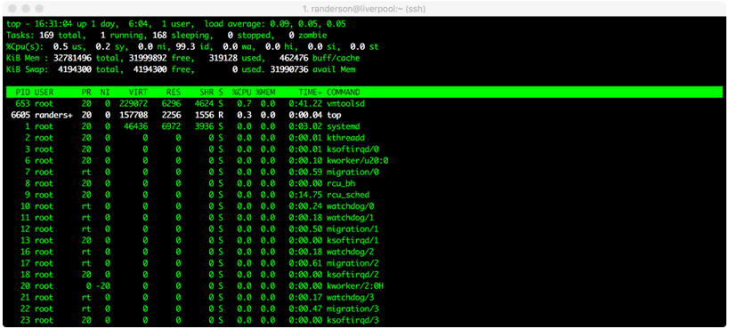

# Week 3: Introduction to Unix/Linux and the Server; Assembly with IDBA-UD

Rika Anderson
Carleton College
Dec 23, 2017

## Connecting to Liverpool

#### Step 1
We are going to do most of our computational work on a remote server (or computer) called Liverpool, which is a Linux virtual machine set up by Carleton ITS for our course. Liverpool basically lives in a computer somewhere in the CMC. You'll be accessing it from the lab computers, but you could also access it from your own computer at home. First, you have to learn how to access Liverpool.

Boot as a Mac user on the lab computer.

#### Step 2
Find and open the Terminal application (it should be in "Applications" in the folder called "Utilities").

*The terminal is the interface you will use to log in to the remote server for the rest of the course. It is also the interface we will be using to run almost all of the bioinformatics software we will be learning in this course. You can navigate through files on the server or on your computer, copy, move, and create files, and run programs using the Unix commands we learned earlier this week.*

#### Step 3
We will use something called ssh, or a secure socket shell, to remotely connect to another computer (in this case it will our class server, liverpool). Type the following:

```bash
ssh [username]@liverpool.its.carleton.edu
```

#### Step 4

You should see something like this: `[your username]@liverpool.its.carleton.edu's password:`

Type in your Carleton password. NOTE!! You will not see the cursor moving when you type your password. Never fear, it is still registering what you type. Be sure to use the correct capitalization and be wary of typos.

#### Step 5

Whenever you ssh in to liverpool, you end up in your own home directory. Each of you has your own home directory on liverpool. To see where you are, print your current working directory.

```bash
pwd
```
>How to print your working directory (find out where you are in the system)


#### Step 6

You should see something like this: `/Accounts/[your username]`

This tells you what your current location is within liverpool, also known as your **path**. But before we actually run any processes, we need to learn a few important things about using a remote shared server.

### Important things to know about when using a remote shared server

#### Step 7: Top

One of the most important things to learn when using a remote shared server is how to use proper **server etiquette.** You don't want to be a computer hog and take up all of the available processing power. Nobody earns friends that way. Similarly, if it looks like someone else is running a computationally intensive process, you might want to wait until theirs is done before starting your own, because running two intensive processes at the same time might slow you both down.

To see what other processes are being run by other users of the same server, type: `top`

You should see something like this:



Here, we can see that randerson is the only user on liverpool, I am using a process called top, and it's taking up 0.3% of one central processing unit (CPU), and zero memory. Not much is going on in this case. (All the other things listed under 'root' are processes that the computer is running in the background.) If someone’s process says 100.0 or 98.00 under %CPU, it means they’re using almost one entire CPU. **Liverpool has 10 CPUs and 32 gigabytes of RAM total.** Therefore, we can use up to 10 CPUs. If we try to overload the computer, it means that everyone else's processes will have to be shared among the available CPUs, which will slow everyone down. If it looks like all 10 CPUs are already being used at a particular time, you might want to wait until later to run your own process.

To quit out of top, type: `q`

#### Step 8: Screen

Sometimes we will run processes that are so computationally demanding that they will run for several hours or overnight. Some processes can sometimes take several days, or even weeks. In order to run these processes, you want to be able to close out your session on the remote server without terminating your process. To do that, you use screen. Type: `screen`

Your terminal will open a clean window. You are now in a screen session. Any processes you start while you are in a screen session will continue running even after you log off of the remote server.

Let's say you've typed the commands for a process, and now you're ready to exit your screen session to let it run while you do other things. To leave the screen session, type: `Control+A d`

This will "detach" you from the screen session and allow you to do other        things. Your screen session is still running in the background.

To resume your screen session to check on things, type: `screen -r`. (Now you've re-entered your screen session.)

To kill your screen session (this is important to tidy up and keep things neat when your process is finished!) type: `Control+A k`.
- The computer will say: `Really kill this window [y/n]`. You type: `y`.
- If this doesn't work, you can also type `exit` to terminate the screen session.

## Creating an assembly and evaluating it

#### Step 9

Let’s say we’ve gone out in to the field and taken our samples, we’ve extracted the DNA, and we’ve sent them to a sequencer. Then we get back the raw sequencing reads. One of the first things we have to do is assemble them. To do that, we’re going to use a software package called IDBA-UD. Bioinformaticians love to debate about which assembler is best, but ultimately it usually depends on the nature of your own dataset. If you find yourself with data like this someday and you want to know which assembler to use, my advice is to try a bunch of them and then compare the results using something like Quast, which we’ll test below. For now, we’re going to use IDBA-UD, which I’ve found to be a good general-purpose assembler.

Make a new directory in your home folder:

```bash
mkdir toy_dataset_directory
```

#### Step 10

Change directory into your toy dataset directory:

```bash
cd toy_dataset_directory
```

#### Step 11

Copy the toy dataset into your assembly directory. Don’t forget the period at the end! This means you are copying into the directory you are currently in.

```bash
cp /usr/local/data/toy_datasets/toy_dataset_reads.fasta .
```

#### Step 12

Run idba-ud on the toy dataset. Here is what these commands mean:

1. Invoke the program `idba-ud`
2. The `-r` gives it the "path" (directions) to the reads for your toy dataset. `../` means it is in the directory outside of the one you're in.
3. The `-o` flag tells the program that you want the output directory to be called “toy_assembly”

```bash
idba_ud -r toy_dataset_reads.fasta -o toy_assembly
```

#### Step 13

When that’s done running, go into your new output directory and take a look at what’s inside:

```bash
cd toy_assembly
ls
```

#### Step 14

You should see several files, including these:

```
contig.fa
contig-20.fa
contig-40.fa
contig-60.fa
contig-80.fa
contig-100.fa
scaffold.fa
```

You may recall that De Bruijn graph assembly works by searching reads for overlapping words, or "kmers." IDBA-UD starts by searching for small kmers to assemble reads into longer contigs. Then it uses those constructed contigs for a new round of assembly with longer kmers. Then it does the same with even longer kmers. It iterates through kmers of length 20, 40, 60, 80, and 100. You should get longer and longer contigs each time. Each "contig-" file gives the results of each iteration for a different kmer size. The "scaffolds.fa" file provides the final scaffolded assembly, which pulls contigs together using the paired-end data.

#### Step 15

Let's examine the assembly output files. First, take a look at your final scaffold output:

`less scaffold.fa`

#### Step 16

You should see a fasta file with some very long sequences in it. When you're done looking at it, type: `q`.

#### Step 17

Now we’re going to evaluate the quality of our assembly. One measure of assembly quality is N50, which is the contig length for which the collection of all contigs of that length or longer contains at least 50% of the sum of the lengths of all contigs. We could theoretically calculate the N50 by hand, but often times you’ll get many, many contigs and it’s very tedious to do by hand. So we will use an assembly evaluator called Quast. Run it on your toy dataset. (If you’ve been copying and pasting, it may not work here; you may have to type it in.) Here is what the commands mean:

1. Invoke the program `quast.py`
2. We tell it to run the program on all of the output files of your toy assembly. Every fasta file that we list after `quast.py` will be included in the analysis.
3. The `-o` flag will create an output directory that we will call `toy_assembly_quast_evaluation`

```bash
quast.py contig-20.fa contig-40.fa contig-60.fa contig-80.fa contig-100.fa scaffold.fa –o toy_assembly_quast_evaluation
```

#### Step 18

Quast gives you some nice visual outputs that are easiest to see if you log in to x2go. More detailed instructions are here:

https://wiki.carleton.edu/display/carl/How+to+Install+and+Configure+x2go+client

1. Find x2go on your lab computer and open it.
2. Click “New session” in the top left of the screen (it’s an icon with a piece of paper with a yellow star on it.)
3. Enter “liverpool.its.carleton.edu” in the Host box. Choose the SSH port to be 22. The session type should be XFCE. You can set the session name to “Liverpool” or whatever you like. Click OK.
4. Click on your newly created session, which should appear on the right side of the window.
5. Log in with your Carleton account name and password.
6. Navigate to the directory called “toy_assembly_quast_evaluation.”
7. Double-clock on the file called “report.html” and take a look. It reports the number of contigs, the contig lengths, the N50, and other statistics for each of the assembly files you entered. The graph at the bottom shows the cumulative length of your assembly (y-axis) as you add up each contig in your assembly (x-axis). Many of your lab questions for this week are based on the quast assembly report.
8. When you are done with x2go, be sure to click on “Log Out” when you log out!
